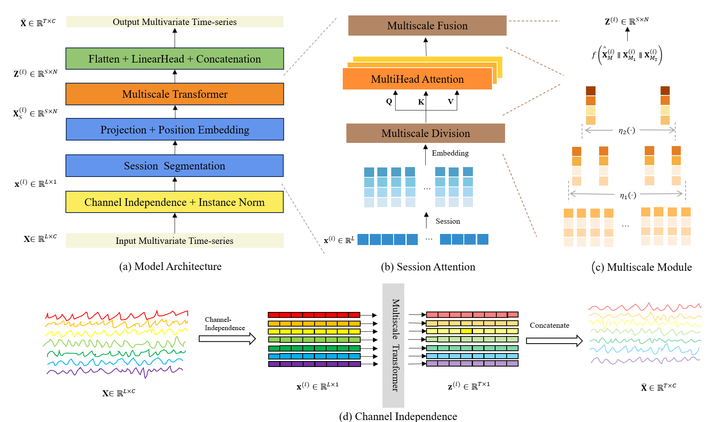
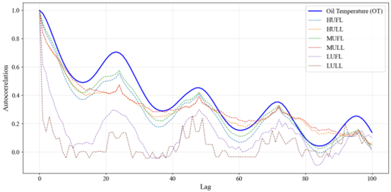
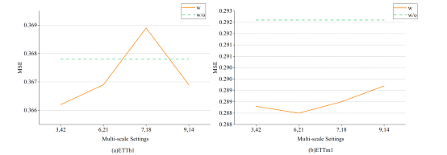
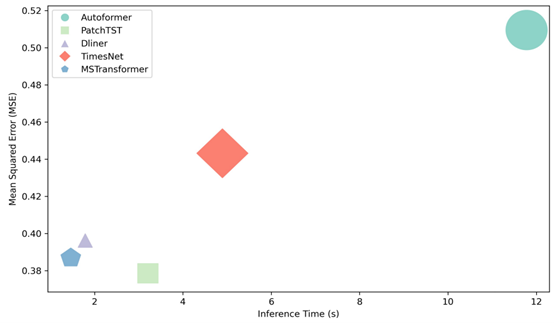
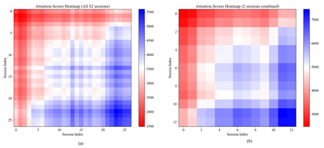

# MSTransformer

### This is an offical introduction of MSTransformer
Oil temperature prediction in power transformers is a crucial task, encompassing the forecasting of variations in insulation oil temperature, essential for monitoring and analyzing the condition of these transformers. Existing long-term sequence forecasting methods exhibit two key limitations. Firstly, most models concentrate solely on correlating limited time periods, neglecting potential interactions between subsequences, and resulting in inaccurate trend predictions. Secondly, existing modeling approaches overlook the significance of periodic variations with diverse cyclic thermal characteristics that are fundamentally important for forecasting future oil temperature trends. To overcome these limitations, we propose MSTransformer (Transformer-based Multi-scale Session-enhanced model), a novel approach for accurately predicting the temperature of the oil of the power transformer. Our model addresses the limitations by segmenting long time series into session-level sessions and applying self-attention Transformer framework to these sessions. This enables effective capture of semantic information across long sequences while reducing model complexity. Furthermore, we introduce a multiscale module to account for both short- and long-term sequence dependencies, including periodic changes. This module enables simultaneous encoding of fine- and coarse-grained sequence patterns. By incorporating these periodic variations, our model enhances the accuracy and stability of the temperature predictions. Extensive experiments validate our method's excellent predictive capabilities in accurately forecasting power transformer oil temperature. Meanwhile, to validate the model's generalization capability, we conducted extensive experiments on multiple publicly available multivariate time series datasets.

## Framework

Fig.1 The comprehensive architecture of our model is illustrated in Figure 1(a), comprising four integral components: the preprocessing module, the session segmentation module, the multiscale Transformer module, and the post-processing module. The preprocessing module initiates the process by handling the original sequences, wherein multivariate data is decomposed into univariate streams through channel-wise independence. Following standard normalization, these univariate sequences, derived from diverse channels, are subsequently fed into the session segmentation module. As depicted in Figure 1(b), this module systematically partitions the univariate sequences from each channel into uniformly sized sessions, thereby optimizing the computational efficiency of the MSTransformer. Figure 1(c) delineates the multiscale module, which reassembles session subsequences across varying granularities to capture the nuanced temperature features over distinct time periods, subsequently amalgamating these features to generate the final prediction outcomes. Lastly, Figure 1(d) elucidates the principle of channel-wise independence, wherein multivariate sequences are independently transformed into univariate counterparts via respective channels.

## Analyse

Fig.2 Autocorrelation of all variables in the ETTh2 dataset.

As shown in Figure , which is based on real data from ETTh2 (a detailed description of the dataset is provided in Section 5.1), these influences manifest across different time ranges. The blue curve in the figure represents the target variable 'OT', which exhibits short-term local continuity, gradually decreasing in autocorrelation before recovering in a cyclic manner. Other variables display both short-term periodic patterns and long-term trends, indicating the presence of daily and weekly seasonality. These patterns highlight the necessity of developing a model that effectively captures the oil temperature characteristics across multiple time scales, ensuring accurate forecasting under varying temporal dependencies.

## Experiments

Fig.3 Review Window Size Distribution Analysis.

The multiscale approach employed in the model allows for the extraction of feature information from multiple scales, enabling a more comprehensive capture of the underlying structure and patterns within the data. 

Fig.4 Model comparison of the spatiotemporal efficiency on ETTh1.

To thoroughly demonstrate the effectiveness of MSTransformer, we conduct a comparative analysis against representative baseline models specifically on the ETTh1 dataset.

Fig.5 Multiscale Attention Heatmap.

Through a comparative analysis, we have discerned certain variations in attention score values across different calculation methods, suggesting that a more fine-grained approach facilitates more precise attention allocation during the computation process.
## Acknowledgement

We appreciate the following github repo very much for the valuable code base and datasets:

https://github.com/cure-lab/LTSF-Linear

https://github.com/zhouhaoyi/Informer2020

https://github.com/thuml/Autoformer

https://github.com/MAZiqing/FEDformer

https://github.com/alipay/Pyraformer

https://github.com/ts-kim/RevIN

https://github.com/timeseriesAI/tsai

https://github.com/yuqinie98/PatchTST

