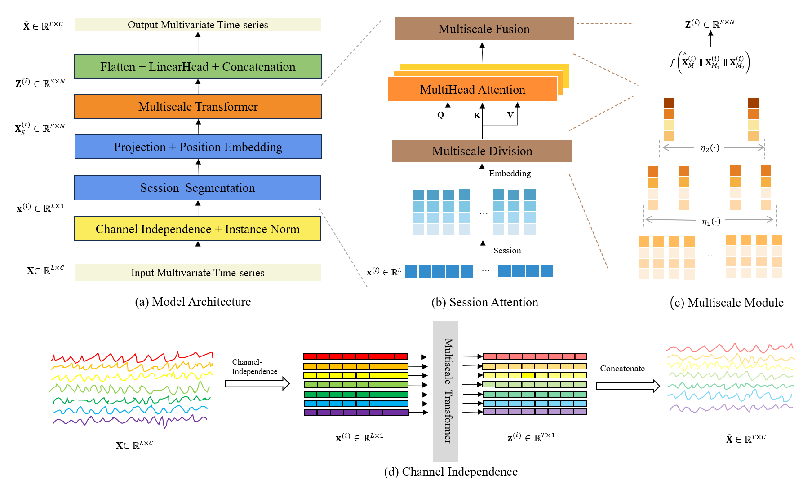
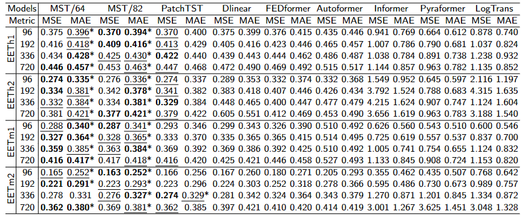

# MSTransformer

### This is an offical introduction of MSTransformer
Oil temperature prediction in power transformers is an important task that involves forecasting variations in the temperature of insulating oil, which is crucial for monitoring and analyzing the condition of power transformers. Existing long-term sequence forecasting methods exhibits two key limitations. Firstly, most models concentrate solely on correlating a limited number of time periods when predicting long sequences thus fails to consider the potential interactions between subsequences, resulting in inaccurate predictions of sequence trends. Secondly, existing models neglects periodic variations characterized by varying cycle temperature properties, which plays a crucial role in forecasting future oil temperatures. To overcome these limitations, we propose a novel approach called MSTransformer (Transformer-based \textbf{M}ulti-scale \textbf{S}ession-enhanced model) for accurately predicting the oil temperature in power transformers. Our model addresses the limitations by segmenting the long time series into subsection-level sessions and applying the self-attention Transformer framework to these sessions. This enables the model to effectively capture almost all semantic information across long sequences while reducing the complexity of the modeling process. Furthermore, to account for both short- and long-term sequence dependencies, including the periodic changes, we introduce a multi-scale computational module. This module allows for the simultaneous encoding of fine and coarse-grained sequence patterns. By incorporating these periodic variations, our model enhances the accuracy and stability of the temperature predictions. The performance of our proposed method has been extensively evaluated via experiments, and the results clearly demonstrate its excellent predictive capabilities in accurately forecasting the temperature of power transformer oil. 

## Framework

## Results

## Acknowledgement

We appreciate the following github repo very much for the valuable code base and datasets:

https://github.com/cure-lab/LTSF-Linear

https://github.com/zhouhaoyi/Informer2020

https://github.com/thuml/Autoformer

https://github.com/MAZiqing/FEDformer

https://github.com/alipay/Pyraformer

https://github.com/ts-kim/RevIN

https://github.com/timeseriesAI/tsai

